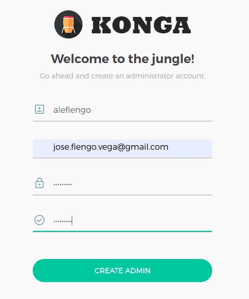
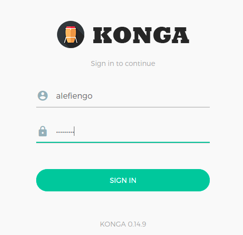
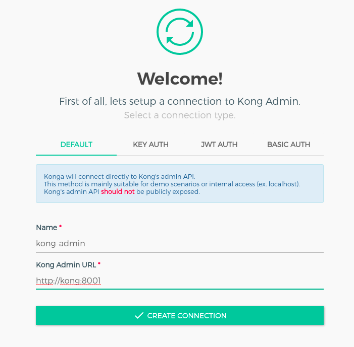

# docker-kongapigateway+konga
Kong API Gateway + Postgres 9.6 + konga


## Prerrequisitos

* [Docker Engine](https://docs.docker.com/engine/install/)
* [Docker Compose](https://docs.docker.com/compose/install/)

## Desplegar contenedores

### Pasos

1) Clonar el repositorio
```
git clone https://github.com/alefiengo/docker-kongapigateway-konga
```

2) Dentro del directorio `docker-kongapigateway-konga`, ejecutar
```
docker-compose up -d --build
```

## Explorar
### Pasos

1) Desde un navegador, ingresar a la URL `http://localhost:1337`

2) Registrar un usuario:



3) Ingresar con las credenciales registradas en el paso 1)



4) Configurar la conexión de konga a kong

